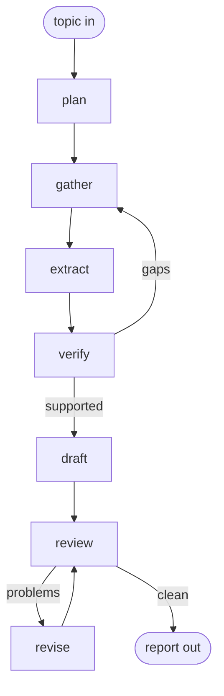

# Workflow: research-topic

Input: a topic, plus `source_floor`, the least number of primary sources
the run accepts. Output: a report file whose every claim carries a checked
source.

The run splits the work three ways. One set of steps collects and reads
sources. A second set checks the claims against those sources. A third set
writes and edits the report. No step checks its own output.

## Graph

`topic` and `report` carry no `click` line. They are markers, not steps.
They show what enters the run and what leaves it. The run starts at
`entry`, which is `plan`.

## Cycles

The graph holds two cycles.

| Cycle | Edge that opens it | What it repairs |
|---|---|---|
| Source gap | `verify -- gaps --> gather` | A claim with no source that holds it up. |
| Draft fault | `review -- problems --> revise` | A draft the sources do not support. |

`max_step_visits` is 3. The orchestrator counts visits per node and stops
the run at the cap. A topic that needs a fourth pass needs a person.

## Model split

`extract` runs on `sonnet`. `verify` runs on `opus`. `draft` runs on
`sonnet`. `review` runs on `opus`. A check never runs on the model class
that produced the work it checks.
