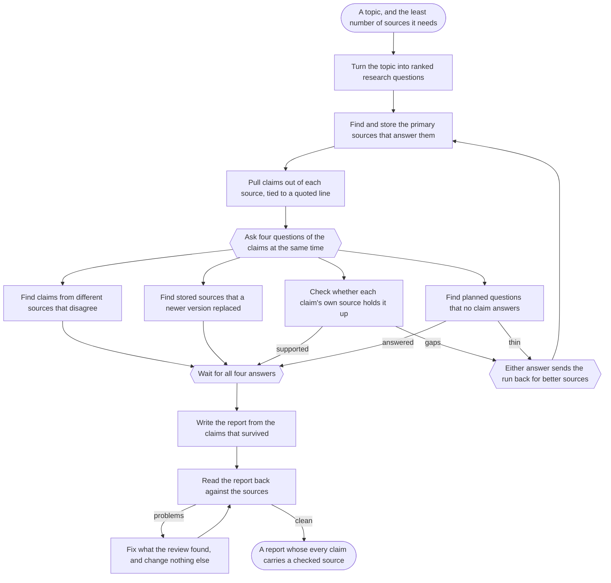

# Workflow: research-topic

Input: a topic, plus `source_floor`, the least number of primary sources
the run accepts. Output: a report file whose every claim carries a checked
source.

The run splits the work three ways. One set of steps collects and reads
sources. A second set checks the claims against those sources. A third set
writes and edits the report. No step checks its own output.

## Graph

Every node declares its label first, then the edges reference it by id.
The label says in plain words what happens there. The id is the machine
handle: it matches the folder name and the `click` target, and nothing
else uses it.

Five nodes carry no `click` line, so no step runs at them. Two are end
markers. Three are control markers: a fork, a join, and a merge. The
frontmatter's `entry` names where a run starts.

Edge labels stay short. They are not prose. A step returns one of them as
its outcome, and a step's frontmatter can name one to break a tie.

## What this file does not say

This file holds the graph, and nothing the graph already carries.

| Question | Where the answer is |
|---|---|
| What runs after what? | The diagram. |
| Which agent, model, gate, or fan-out does a step use? | That step's frontmatter, through its `click` line. |
| What does a step actually do? | That step's body. |
| How is a fork, a join, a merge, or a mapped step run? | `agents/orchestrator/agent.md`. |

Restating any of that here would give it a second home. The copy would go
stale the first time someone tuned a step, and a reader would have no way
to tell which one was true. The lint rejects a step name in this prose for
that reason.

`README.md` carries the narrative tour of this workflow. It is
documentation for a person, not an input to a run.

## Cycle bound

The graph holds cycles, and two branches can send the run backward. Both
route through the merge marker, so the picture shows where a run turns
around instead of leaving it to prose. `max_step_visits` is 3. The
orchestrator counts visits per node and stops the run at the cap. A topic
that needs a fourth pass needs a person.

This is the one runtime rule that is not derivable from the graph or from
a step, so it lives here, in this file's frontmatter.
